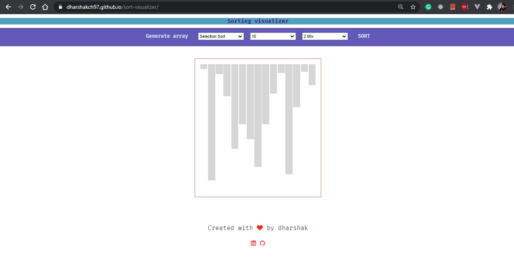

# 🎨 Sorting Visualizer - Beautiful Interactive Algorithm Visualization

A stunning, modern web application that visualizes various sorting algorithms with beautiful animations and an intuitive user interface.



## ✨ Features

### 🎯 **Interactive Sorting Algorithms**
- **Bubble Sort** - Simple comparison-based algorithm
- **Selection Sort** - In-place comparison sorting
- **Insertion Sort** - Simple adaptive sorting algorithm
- **Merge Sort** - Divide and conquer approach
- **Quick Sort** - Efficient comparison-based sorting

### 🚀 **Beautiful UI/UX Design**
- **Modern Gradient Design** - Eye-catching color schemes
- **Smooth Animations** - Fluid transitions and micro-interactions
- **Responsive Layout** - Works perfectly on all devices
- **Glassmorphism Effects** - Modern backdrop blur and transparency
- **Interactive Elements** - Hover effects and visual feedback

### ⚙️ **Customization Options**
- **Array Size Control** - From 5 to 100 elements
- **Speed Control** - 0.5x to 4x visualization speed
- **Real-time Updates** - Live array size and algorithm display
- **Dynamic Generation** - Generate new random arrays instantly

### 📱 **Responsive Design**
- **Mobile-First Approach** - Optimized for all screen sizes
- **Touch-Friendly Interface** - Perfect for tablet and mobile use
- **Adaptive Layout** - Automatically adjusts to device capabilities

## 🎨 Design Highlights

### **Color Scheme**
- **Primary Gradient**: Beautiful blue to purple transitions
- **Accent Colors**: Vibrant teals and pinks for highlights
- **Success States**: Green gradients for completed operations
- **Warning States**: Orange and yellow for active processes

### **Typography & Icons**
- **Modern Fonts**: Inter and Roboto for excellent readability
- **Icon Integration**: Font Awesome 6 icons throughout the interface
- **Visual Hierarchy**: Clear distinction between different UI elements

### **Animations & Transitions**
- **Smooth Transitions**: 0.3s ease transitions for all interactions
- **Staggered Animations**: Sequential cell appearance for better UX
- **Loading States**: Spinner animations during sorting operations
- **Hover Effects**: Subtle lift and shadow effects on interactive elements

## 🚀 Getting Started

### **Prerequisites**
- Modern web browser (Chrome, Firefox, Safari, Edge)
- No additional software installation required

### **Installation**
1. Clone the repository:
   ```bash
   git clone https://github.com/sarthakporwal/sort-visualizer.git
   cd sort-visualizer
   ```

2. Open `index.html` in your web browser
3. Start visualizing sorting algorithms!

### **Usage**
1. **Generate Array**: Click "Generate Array" to create a new random array
2. **Select Algorithm**: Choose your preferred sorting algorithm
3. **Set Array Size**: Adjust the number of elements (5-100)
4. **Control Speed**: Set visualization speed (0.5x to 4x)
5. **Start Sorting**: Click "Sort" to begin the visualization

## 🛠️ Technical Implementation

### **Frontend Technologies**
- **HTML5** - Semantic markup structure
- **CSS3** - Modern styling with CSS variables and gradients
- **Vanilla JavaScript** - Pure JS for algorithm implementation
- **Font Awesome 6** - Beautiful icon library
- **Google Fonts** - Inter and Roboto typography

### **Key Features**
- **CSS Custom Properties** - Consistent theming system
- **Flexbox Layout** - Responsive and flexible design
- **CSS Grid** - Advanced layout capabilities
- **Backdrop Filters** - Modern glassmorphism effects
- **CSS Animations** - Smooth keyframe animations

### **Performance Optimizations**
- **Efficient Rendering** - Optimized DOM manipulation
- **Smooth Animations** - Hardware-accelerated CSS transitions
- **Responsive Images** - Optimized for different screen densities
- **Minimal Dependencies** - Lightweight and fast loading

## 📱 Responsive Breakpoints

- **Desktop**: 1200px and above
- **Tablet**: 768px - 1199px
- **Mobile Large**: 480px - 767px
- **Mobile Small**: Below 480px

## 🎯 Browser Support

- **Chrome** 90+
- **Firefox** 88+
- **Safari** 14+
- **Edge** 90+

## 🤝 Contributing

Contributions are welcome! Please feel free to submit a Pull Request.

### **Development Setup**
1. Fork the repository
2. Create a feature branch
3. Make your changes
4. Test thoroughly
5. Submit a pull request

## 📄 License

This project is open source and available under the [MIT License](LICENSE).

## 👨‍💻 Author

**Sarthak Porwal**
- LinkedIn: [sarthak-porwal-8a9b40256](https://www.linkedin.com/in/sarthak-porwal-8a9b40256/)
- GitHub: [sarthakporwal](https://github.com/sarthakporwal)

## 🙏 Acknowledgments

- Font Awesome for the beautiful icons
- Google Fonts for the typography
- The sorting algorithm community for educational resources

---

⭐ **Star this repository if you found it helpful!**

🔄 **Keep learning, keep sorting!**
